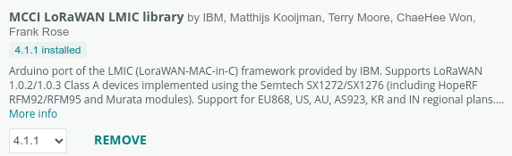
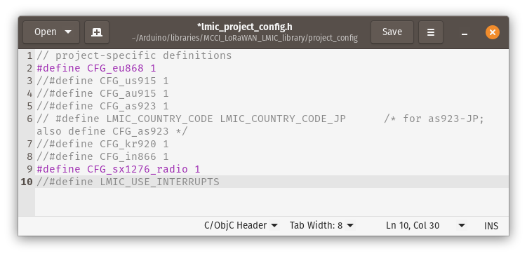
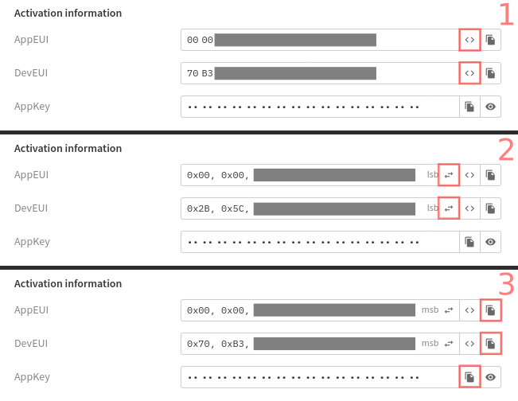

## Setting up the Arduino IDE
# Add the Wemos D1 mini to the list of available devices
In order to be able to program your `Wemos D1 Mini` you need to add the board to the Arduino IDE:

1. Open the Arduino IDE.
2. Go to `File` > `Preferences`
3. Locate the textfield labeled `Additional boards manager URLs` at the bottom of the preferences window
4. If the field is empty, simply enter the following value: `http://arduino.esp8266.com/stable/package_esp8266com_index.json`
5. If the field already has an URL in it (maybe you added a different device in the past) just put a comma `,` at the end of the existing value, and paste the above URL after it.
6. Click OK to save the change and close the preferences window.
7. In the menu click `tools` > `board` > `board manager` and search for `esp8266`. Press install.
8. When Arduino is done installing the files you can select the right device to use: `tools` > `board` > `ESP8266` > `Lolin (Wemos) D1 R2 & mini`
9. Make sure you also select the right port. When in doubt, just unplug the board, check the list of port options, then plug the board back in and note which new port appeared.

### Install the Arduino LoRaWAN library
1. Find and install "MCCI LoRaWAN LMIC Library" from the library manager.

2. Now go into your Arduino libraries folder using Finder or Windows Explorer, and find the `MCCI LoRaWAN LMIC Library` folder. Inside is a folder called `project_config` with a single file called `lmic_project_config.h`. Open this file in some text editor.
4. Find the line `#define CFG_eu868 1` and uncomment it by removing the `//` in front of it, and comment out the other frequency plans by adding `//` in front of them. This will make sure the library is set up for the European frequency plan. So the file will look like this:
 

## Getting started with The Things Network
### Create an account
1. Go to [thethingsnetwork.org](https://www.thethingsnetwork.org/) and click the `sign up` button in the top right.
2. Select the `Join The Things Network` option on the left (not `Get started for free`).
3. Confirm your email address via the email they'll send you and log in.
4. Select the region you are in (e.g. `Europe 1`).
5. In the menu in the top right, click `console` to get to your console dashboard.

### Create your application and login credentials
We need to create an application on TTN. This application will be the place where we can access any data being sent from our node.

1. In the menu bar select `Applications` and create your application.
2. In the menu bar on the left select `integrations` > `MQTT`.
3. At the bottom of the page, click `Generate new API key`

### Register your node to the application
Now we need to add our node to the application. This gives us some codes we can paste into the Arduino project, which will let TTN know what application our node belongs to.

1. Go to `applications` > select your application
2. On the bottom right select `Register end device`
3. For `input method` select `Enter end device specifics manually` and use these settings:

* Frequency plan: `Europe 863*871 MHz (SF9 for RX2 - recommmended)`
* LoRaWAN version: `LoRaWAN Specification 1.0.3`
* Regional Parameters version: `RP001 Regional Parameters 1.0.3 revision A`
* JoinEUI: `00 00 00 00 00 00 00 00`
4. Press `confirm` next to the JoinEUI field
5. Press `Generate` behind the DevEUI and APPKey fields
6. The `End device ID` gets filled in automatically: replace this value with a human-0readable name, like `jaspers node`
7. Press `Register end device` to finish

You now have all information you need to start programming your Wemos D1 mini to send data to The Things Network. Specifically what you need to copy to the Arduino code are the `AppEUI`, `DevEUI` and `AppKey` values.

First, click the `<>` icon behind the `AppEUI` and `DevEUI` fields. The text `msb` and two little arrows appear. Click those arrows to change the format to `lsb` (this basically reverses the values which is needed by the Arduino library), then press the copy icon to copy the value to your clipboard and paste them into the right spot in the Arduino code.

